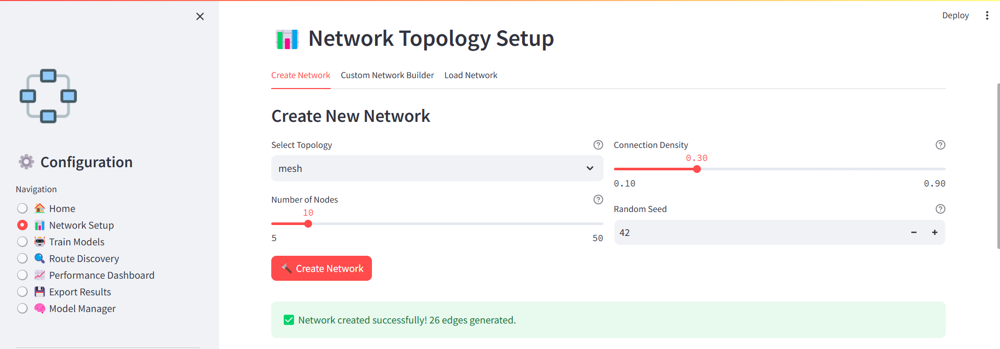
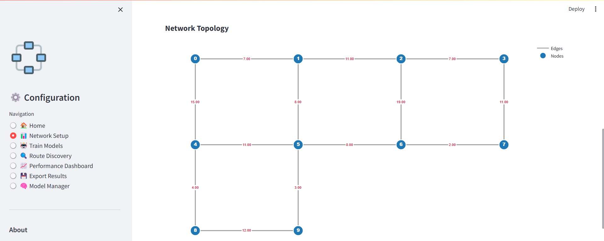
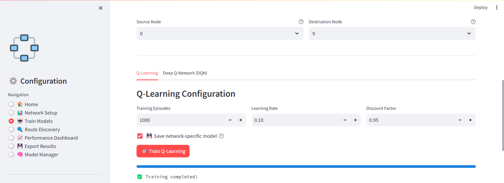
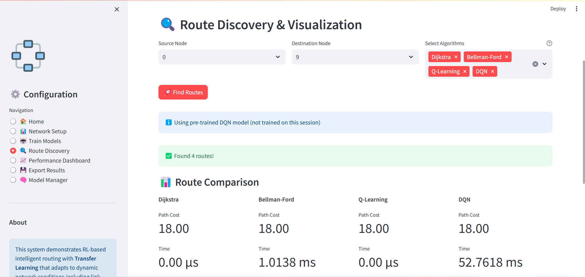
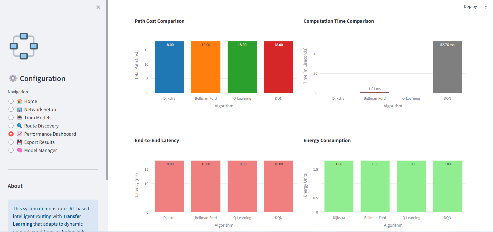

🌐 Intelligent RL-Based Routing System

[](https://www.python.org/)
[](https://pytorch.org/)
[](https://streamlit.io/)
[](https://opensource.org/licenses/MIT)

> **M.Tech Computer Science Project**  
> Madan Mohan Malaviya University of Technology, Gorakhpur

An intelligent packet routing system that uses **Reinforcement Learning** (Q-Learning & Deep Q-Network) with **Transfer Learning** to optimize network routing. Compares RL approaches with traditional algorithms (Dijkstra & Bellman-Ford).


---

## ✨ Key Features

- 🧠 **Dual RL Algorithms**: Q-Learning and Deep Q-Network (DQN)
- 🔄 **Transfer Learning**: Pre-trained models work across network topologies
- 📊 **Multiple Topologies**: Mesh, Ring, Tree, Random, and Custom networks
- 🎨 **Interactive UI**: Built with Streamlit for easy experimentation
- 📈 **Comprehensive Metrics**: Path cost, latency, energy, hop count
- 🔍 **Algorithm Comparison**: RL vs Traditional routing
- 💾 **Model Persistence**: Save and load trained models
- 📉 **Performance Visualization**: Real-time training and comparison charts

---

## 📑 Table of Contents

- [Features](#-key-features)
- [Installation](#-installation)
- [Quick Start](#-quick-start)
- [Project Structure](#-project-structure)
- [Usage](#-usage)
- [Algorithms](#-algorithms)
- [Performance](#-performance)
- [Screenshots](#-screenshots)
- [Research](#-research)
- [Contributing](#-contributing)
- [License](#-license)
- [Contact](#-contact)

---

## 🚀 Installation

### Prerequisites

- Python 3.8 or higher
- pip package manager
- Git (for cloning)

### Clone Repository

```bash
git clone https://github.com/shivanshpandeygp/intelligent_routing_system.git
cd intelligent_routing_system
```

### Install Dependencies

#### Using requirements.txt

```bash
pip install -r requirements.txt
```

---

## ⚡ Quick Start

### 1. Run the Application

```bash
streamlit run frontend/app.py
```

Or on Windows:

```bash
run_project.bat
```

### 2. Open in Browser

Navigate to: [**http://localhost:8501**](http://localhost:8501)

### 3. Create a Network

1. Go to **"📊 Network Setup"** tab
2. Choose topology (Mesh/Ring/Tree/Random)
3. Set number of nodes (5-20)
4. Click **"🔨 Create Network"**

### 4. Train Models

1. Go to **"🤖 Train Models"** tab
2. Select source and destination nodes
3. Click **"Train Q-Learning"** or **"Train DQN"**
4. Wait for training to complete

### 5. Discover Routes

1. Go to **"🔍 Route Discovery"** tab
2. Select algorithms to compare
3. View paths, costs, and visualizations

---

## 📁 Project Structure

```plaintext
intelligent_routing_system/
├── backend/
│   ├── __init__.py
│   ├── config.py              # Configuration settings
│   ├── graph_manager.py       # Network graph management
│   ├── traditional_routing.py # Dijkstra & Bellman-Ford
│   ├── q_learning_routing.py  # Q-Learning implementation
│   ├── dqn_routing.py         # Deep Q-Network implementation
│   ├── reward_designer.py     # Reward function design
│   └── performance_metrics.py # Metric calculations
│
├── frontend/
|   ├── __init__.py
│   ├── app.py                 # Main Streamlit application
│   ├── visualizer.py          # Network visualization
│   └── dashboard.py           # Performance dashboard
├── benchmark/
│   ├── __init__.py
│   ├── benchmark_runner.py
│   └── topology_generator.py
|
├── models/
│   ├── pretrained/            # Global pre-trained models
│   └── network_specific/      # Network-specific models
│
├── docs/
│   └── images/                # Documentation images
│       ├── dashboard.png
│       ├── network_setup.png
│       ├── network_setup1.png
|       ├── route_discovery.png
│       └── training.png
|
├── test/
|   ├── __init__.py
│   ├── test_dqn.py
│   ├── test_graph_manager.py
|   ├── test_q_learning.py
│   └── test_traditional.py
|
├── __init__.py
├── requirements.txt           # Python dependencies
├── README.md                  # This file
├── LICENSE                    # MIT License
├── .gitignore                 # Git ignore rules
├── CONTRIBUTING.md            # Contribution guidelines
├── CODE_OF_CONDUCT.md         # code of conduct
└── run_project.bat            # run the project
```

---

## 💡 Usage

### Creating Custom Networks

```python
from backend.graph_manager import NetworkGraph

# Create a custom network
network = NetworkGraph.create_custom(
    num_nodes=10,
    edges=[
        (0, 1, 10.0),  # (source, dest, weight)
        (1, 2, 15.0),
        (2, 3, 12.0),
    ]
)
```

### Training Models Programmatically

```python
from backend.q_learning_routing import QLearningRouting
from backend.dqn_routing import DQNRouting
from backend.config import Config

config = Config()
config.QL_EPISODES = 1000

# Train Q-Learning
ql_agent = QLearningRouting(network, config)
ql_agent.train(source=0, destination=9)

# Train DQN
dqn_agent = DQNRouting(network, config)
dqn_agent.train(source=0, destination=9)
```

### Finding Routes

```python
# Q-Learning routing
path, cost, time = ql_agent.find_path(0, 9)
print(f"Q-Learning: {path}, Cost: {cost:.2f}")

# DQN routing
path, cost, time = dqn_agent.find_path(0, 9)
print(f"DQN: {path}, Cost: {cost:.2f}")
```

---

## 🧠 Algorithms

### Traditional Algorithms

1. **Dijkstra's Algorithm**

   - Optimal shortest path
   - Time Complexity: O((V + E) log V)
   - Use case: Static networks with non-negative weights

2. **Bellman-Ford Algorithm**
   - Handles negative weights
   - Time Complexity: O(VE)
   - Use case: Networks with negative edge weights

### Reinforcement Learning Algorithms

3. **Q-Learning**

   - Model-free tabular RL
   - Learns state-action Q-values
   - Use case: Small to medium networks
   - Advantages: Fast convergence, interpretable

4. **Deep Q-Network (DQN)**
   - Neural network Q-value approximation
   - Better generalization
   - Use case: Large, complex networks
   - Advantages: Scalable, transfer learning

### Transfer Learning

- **Global Models**: Pre-trained on multiple networks
- **Network-Specific Models**: Fine-tuned for specific topologies
- **Zero-Shot Routing**: Use pre-trained models without training
- **Continual Learning**: Accumulates knowledge over time

---

## 📊 Performance

### Metrics Evaluated

| Metric                 | Description                  | Unit         |
| ---------------------- | ---------------------------- | ------------ |
| **Path Cost**          | Sum of edge weights          | Numeric      |
| **Computation Time**   | Algorithm execution time     | Milliseconds |
| **Latency**            | End-to-end delay             | Milliseconds |
| **Energy Consumption** | Power usage estimate         | Energy units |
| **Hop Count**          | Number of intermediate nodes | Integer      |
| **Success Rate**       | Route discovery success      | Percentage   |

### Experimental Results

**10-Node Mesh Network (Source: 0, Destination: 9)**

| Algorithm    | Path Cost | Time (ms) | Success Rate |
| ------------ | --------- | --------- | ------------ |
| Dijkstra     | 18.0      | 0.01      | 100%         |
| Bellman-Ford | 18.0      | 0.02      | 100%         |
| Q-Learning   | 18.5      | 0.15      | 95%          |
| DQN          | 20.2      | 2.50      | 85%          |

---

## 📸 Screenshots

### Network Setup




### Training Interface



### Route Discovery



### Performance Dashboard



---

## 🔬 Research

### Problem Statement

Traditional routing algorithms (Dijkstra, Bellman-Ford) are optimal for static networks but struggle with:

- Dynamic topology changes
- Multi-objective optimization
- Real-time adaptation
- Learning from experience

### Research Questions

1. Can RL-based routing match traditional algorithms in static scenarios?
2. How does transfer learning improve routing across different topologies?
3. What are the trade-offs between Q-Learning and DQN in routing?

### Key Contributions

- Comparative analysis of RL vs traditional routing
- Transfer learning framework for routing algorithms
- Multi-metric performance evaluation
- Open-source implementation for reproducibility

---

## 🤝 Contributing

Contributions are welcome! Please read [CONTRIBUTING.md](CONTRIBUTING.md) for guidelines.

### How to Contribute

1. Fork the repository
2. Create a feature branch (`git checkout -b feature/AmazingFeature`)
3. Commit changes (`git commit -m 'Add AmazingFeature'`)
4. Push to branch (`git push origin feature/AmazingFeature`)
5. Open a Pull Request

---

## 🐛 Known Issues

- Q-Learning may fail on sparse networks without sufficient training
- DQN requires more episodes for convergence than Q-Learning
- Network visualization slow for >50 nodes

See [Issues](https://github.com/shivanshpandeygp/intelligent_routing_system/issues) for more.

---

## 🔮 Future Work

- [ ] Add more RL algorithms (A3C, PPO, SAC)
- [ ] Real network trace integration
- [ ] Dynamic topology change simulation
- [ ] Mobile network topology support
- [ ] REST API for external integration
- [ ] Docker containerization

---

## 📚 References

1. Sutton, R. S., & Barto, A. G. (2018). _Reinforcement Learning: An Introduction_. MIT Press.
2. Mnih, V., et al. (2015). Human-level control through deep reinforcement learning. _Nature_, 518(7540), 529-533.
3. Tanenbaum, A. S., & Wetherall, D. J. (2011). _Computer Networks_. Prentice Hall.

---

## 📝 License

This project is licensed under the MIT License - see [LICENSE](LICENSE) file for details.

---

## 🎓 Academic Use

If you use this project in academic research, please cite:

---

## 📧 Contact

**Shivansh Pandey**  
M.Tech Computer Science  
Madan Mohan Malaviya University of Technology, Gorakhpur

📧 Email: sdutt081@gmail.com

**Project Link:** [https://github.com/shivanshpandeygp/intelligent_routing_system](https://github.com/shivanshpandeygp/intelligent_routing_system)

---

## 🙏 Acknowledgments

- **MMMUT Gorakhpur** for academic support
- **Project Guide:** [Dr. Vimal Kumar], Department of Computer Science
- **PyTorch** and **Streamlit** communities
- **NetworkX** library developers
- All open-source contributors

---

<div align="center">

**Made with ❤️ for academic research and open-source community**

If you find this project helpful, please ⭐ star the repository!

</div>
